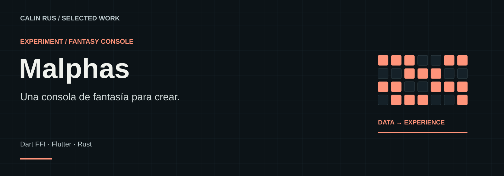
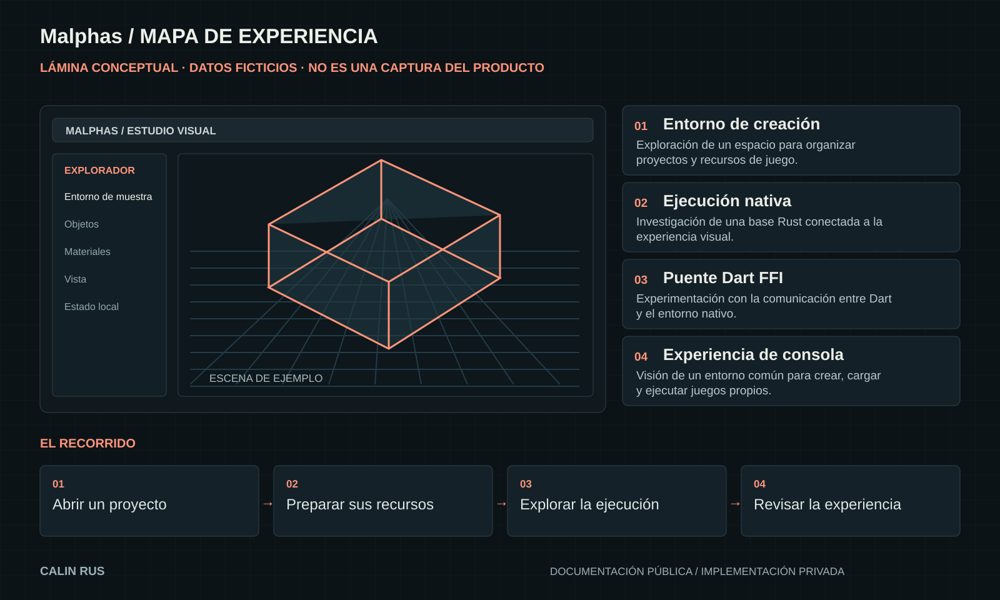

# Malphas

**Un motor. Un espacio de trabajo.**

Un entorno que combina un motor nativo, herramientas de recursos y una interfaz visual para explorar experiencias interactivas.

**Stack:** Rust · Flutter · Dart  
**Estado:** Motor y herramientas en desarrollo

[Portfolio](https://github.com/calinrus-dev/portfolio) · [Experiencia](docs/EXPERIENCIA.md) · [Componentes](docs/COMPONENTES.md) · [Diseño técnico](docs/ARQUITECTURA.md) · [Demostraciones](docs/DEMOSTRACIONES.md) · [Estado](docs/ESTADO.md)

## El problema que aborda

Editar recursos, organizar entornos y observar una ejecución suelen ser tareas separadas. Malphas investiga cómo reunirlas sin mezclar la presentación visual con las responsabilidades del motor.

## Qué compone la experiencia

- **Workspace.** Organización visual de recursos y entornos de trabajo.
- **Vista de ejecución.** Observación de una escena mientras se trabaja sobre sus recursos.
- **Paquetes.** Agrupación de contenido para un entorno concreto.
- **Diagnóstico.** Señales operativas para entender carga, ejecución y recursos.

*Lámina explicativa con datos ficticios. Su contenido también está disponible como texto en [Componentes](docs/COMPONENTES.md).*

## Decisiones que definen el proyecto

- **Presentación reemplazable.** La interfaz expresa el trabajo; el motor conserva las responsabilidades de ejecución.
- **Un entorno como unidad.** Los recursos se presentan con un contexto reconocible para el usuario.
- **Observar antes de afirmar.** Las visualizaciones operativas no sustituyen un benchmark reproducible.

## Explorar el caso

- [Experiencia y recorrido](docs/EXPERIENCIA.md): intención, interacción y criterios de revisión.
- [Componentes](docs/COMPONENTES.md): las piezas visibles y el papel de cada una.
- [Diseño técnico](docs/ARQUITECTURA.md): responsabilidades y compromisos de diseño.
- [Demostraciones](docs/DEMOSTRACIONES.md): qué enseñan las imágenes y cómo leer la evidencia.
- [Estado y siguientes pasos](docs/ESTADO.md): alcance actual, comprobaciones y trabajo pendiente.

## Sobre este repositorio

Caso de estudio público de un proyecto con implementación privada. Reúne documentación, diagramas e imágenes seleccionadas. Los detalles del motor, integraciones, datos operativos y código se mantienen en los repositorios privados.

Revisión editorial: 28 de septiembre de 2026. Autor: [Calin Rus](https://github.com/calinrus-dev).

[calinrus.com](https://calinrus.com) · [Instagram @c4linrus](https://www.instagram.com/c4linrus/) · [Todos los proyectos](https://github.com/calinrus-dev/portfolio)
