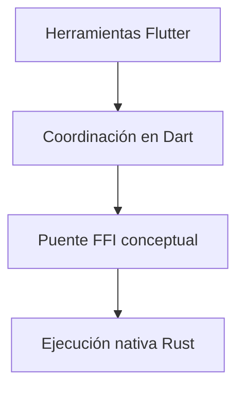

# Malphas / Diseño técnico

[← Inicio](../README.md)

## Contexto

Un experimento de consola de fantasía moderna que explora cómo conectar Flutter y un núcleo nativo Rust mediante Dart FFI, con la intención de ofrecer un entorno donde crear y ejecutar juegos propios.

**Tecnologías asociadas al proyecto:** Dart FFI · Flutter · Rust.

## Mapa de responsabilidades

Este mapa conceptual organiza la explicación del producto; no representa endpoints, procesos desplegados ni contratos internos.

## Un experimento con una dirección clara

La consola de fantasía es la visión de producto; no se presenta como una plataforma terminada para terceros.

## Crear y ejecutar en un mismo contexto

El interés está en conectar el trabajo sobre recursos con la experiencia del juego.

## Investigar el límite entre interfaz y motor

Dart FFI permite explorar esa relación, sin publicar contratos ni implementación interna.

## Rendimiento y dependencia

Mi criterio de trabajo es medir antes de optimizar: identificar el recorrido relevante, observar tiempo de respuesta y uso de recursos y comparar cambios con la misma carga. En sistemas nativos también me interesa la disposición de datos, la localidad de memoria y el trabajo repetido.

Local-first es una preferencia arquitectónica: conservar una experiencia útil y control sobre los datos en el dispositivo, e incorporar servicios externos cuando aporten una función concreta. Su alcance varía por proyecto; no implica que todas las integraciones de este caso funcionen sin conexión.

No se publican cifras de rendimiento sin un ensayo identificado. La evidencia específica disponible está en [Estado](ESTADO.md).

## Qué conviene demostrar después

- Acotar una experiencia mínima de consola de fantasía.
- Preparar un juego propio de muestra para demostrar el recorrido.
- Evaluar la ergonomía de creación y la relación entre Dart FFI y ejecución nativa.
