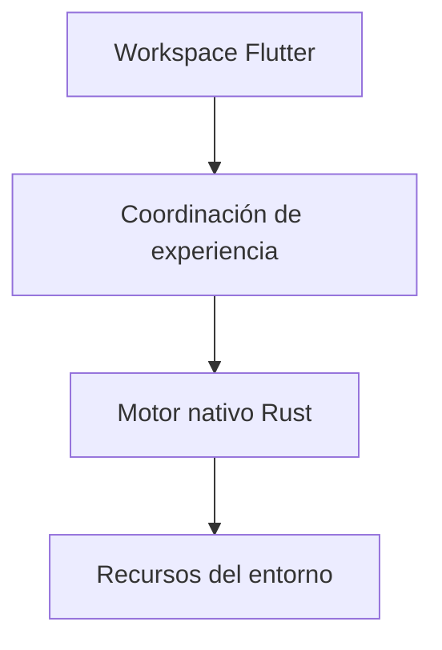

# Malphas / Diseño técnico

[← Inicio](../README.md)

## Contexto

Un entorno que combina un motor nativo, herramientas de recursos y una interfaz visual para explorar experiencias interactivas.

**Tecnologías asociadas al proyecto:** Rust · Flutter · Dart.

## Mapa de responsabilidades

Este mapa conceptual organiza la explicación del producto; no representa endpoints, procesos desplegados ni contratos internos.

## Presentación reemplazable

La interfaz expresa el trabajo; el motor conserva las responsabilidades de ejecución.

## Un entorno como unidad

Los recursos se presentan con un contexto reconocible para el usuario.

## Observar antes de afirmar

Las visualizaciones operativas no sustituyen un benchmark reproducible.

## Rendimiento y dependencia

Mi criterio de trabajo es medir antes de optimizar: identificar el recorrido relevante, observar tiempo de respuesta y uso de recursos y comparar cambios con la misma carga. En sistemas nativos también me interesa la disposición de datos, la localidad de memoria y el trabajo repetido.

Local-first es una preferencia arquitectónica: conservar una experiencia útil y control sobre los datos en el dispositivo, e incorporar servicios externos cuando aporten una función concreta. Su alcance varía por proyecto; no implica que todas las integraciones de este caso funcionen sin conexión.

No se publican cifras de rendimiento sin un ensayo identificado. La evidencia específica disponible está en [Estado](ESTADO.md).

## Qué conviene demostrar después

- Consolidar los recorridos de edición y ejecución.
- Preparar demostraciones reproducibles con recursos de muestra.
- Publicar evidencia visual de estabilidad y comportamiento.
